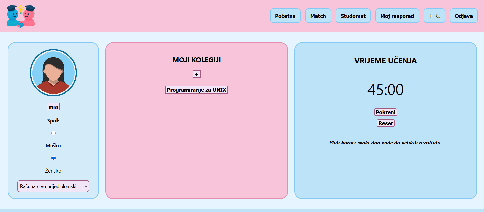
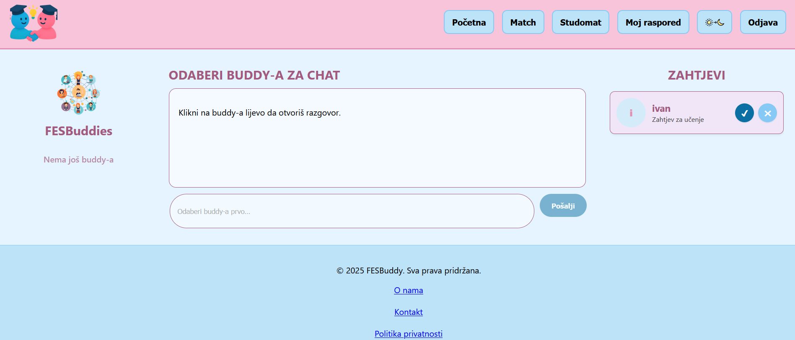
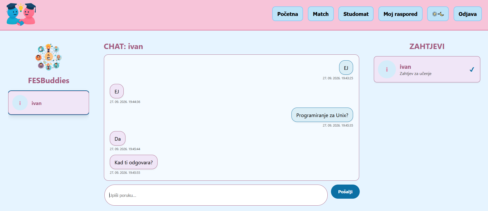
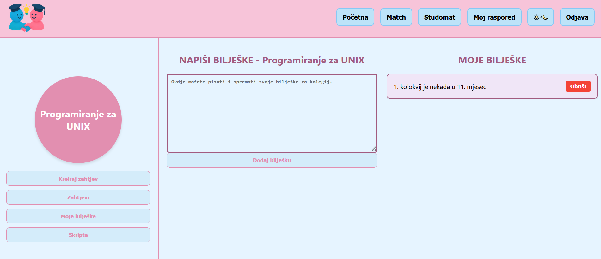

# FESBuddy 🎓

FESBuddy is a web application designed to help students connect with other students, find study partners for specific courses, communicate, organize study materials, and improve their study experience.

The application was developed as a university team project at the Faculty of Electrical Engineering, Mechanical Engineering and Naval Architecture (FESB), University of Split.

## Features

- User registration and authentication
- Student profiles
- Course-based study partner matching
- Sending, accepting and rejecting study partner requests
- Private messaging between matched students
- Personal notes for individual courses
- Uploading and accessing study materials
- Posts and course-related content
- Pomodoro study timer
- Customizable application themes

## Technologies

### Frontend
- React
- JavaScript
- HTML
- CSS
- Axios
- React Router

### Backend
- Node.js
- Express.js
- MySQL
- REST API
- JWT authentication
- bcrypt
- Multer

### Tools
- Git & GitHub
- Visual Studio Code
- MySQL Workbench

## My Contribution

FESBuddy was developed as a team university project. My work was primarily focused on backend development and connecting frontend functionality with the backend and database.

My main contributions included:

- Developing backend functionality using Node.js and Express.js
- Working with the MySQL database and integrating application data with the backend
- Implementing the study partner matching system, including sending and managing match requests
- Developing the private messaging functionality between matched users
- Implementing backend functionality for posts and connecting it with the frontend
- Integrating frontend components with REST API endpoints
- Contributing to parts of the React frontend
- Using Git and GitHub for version control throughout the development process

## Screenshots

### Home

User profile, enrolled courses and integrated Pomodoro study timer.



### Study Partner Matching

Users can send, accept or reject study partner requests.



### Private Messaging

Matched students can communicate through private conversations.



### Course Notes

Students can create and manage personal notes for individual courses.



## Project Structure

```text
FESBuddy/
├── backend/          # REST API, authentication and database communication
├── my-react-app/     # React frontend
├── docs/
│   └── screenshots/  # Application screenshots
└── README.md
```

## Running the Project Locally

### Backend

Navigate to the backend directory:

```bash
cd backend
npm install
npm start
```

For development with automatic server restart:

```bash
npm run dev
```

Create a `.env` file inside the `backend` directory and configure the required environment variables:

```env
DB_HOST=your_database_host
DB_USER=your_database_user
DB_PASSWORD=your_database_password
DB_NAME=your_database_name
JWT_SECRET=your_jwt_secret
```

### Frontend

Open another terminal and navigate to the frontend directory:

```bash
cd my-react-app
npm install
npm start
```

## Security

Sensitive configuration such as database credentials and JWT secrets is stored using environment variables and is not included in the repository.

## About

FESBuddy was created as part of a university project focused on developing a web application that supports collaboration and communication between students.